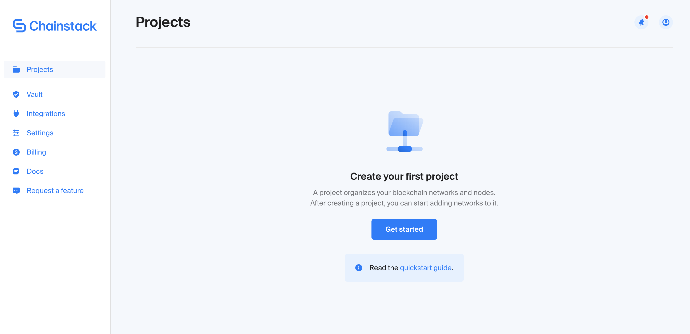
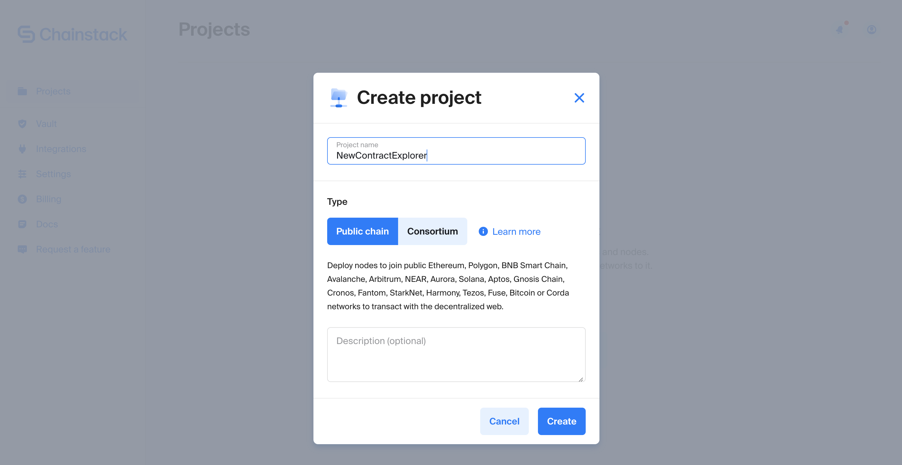
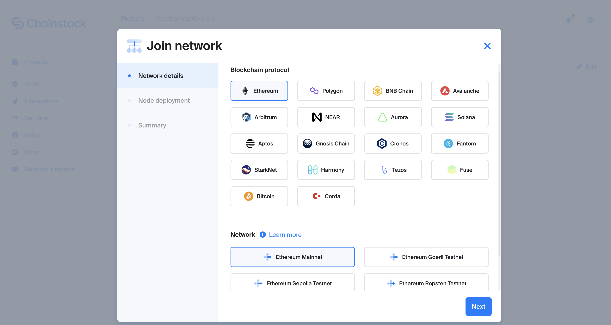
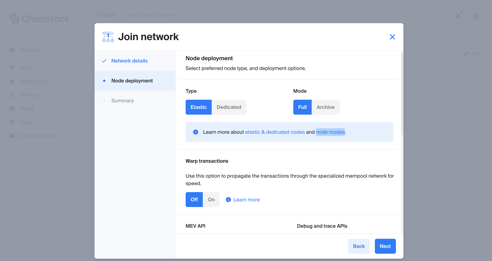
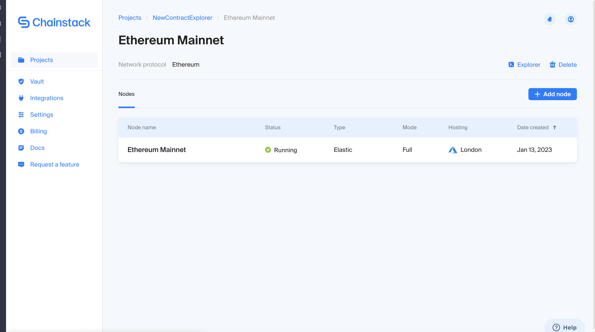
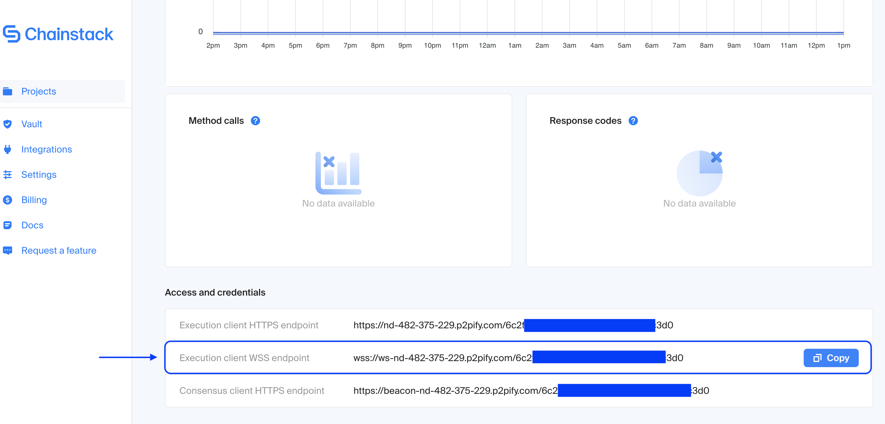
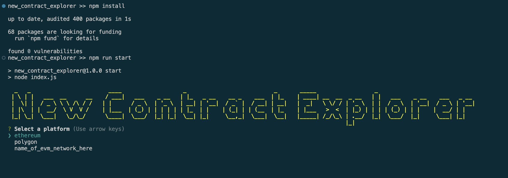
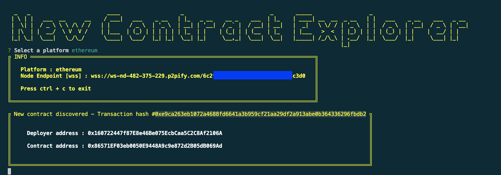
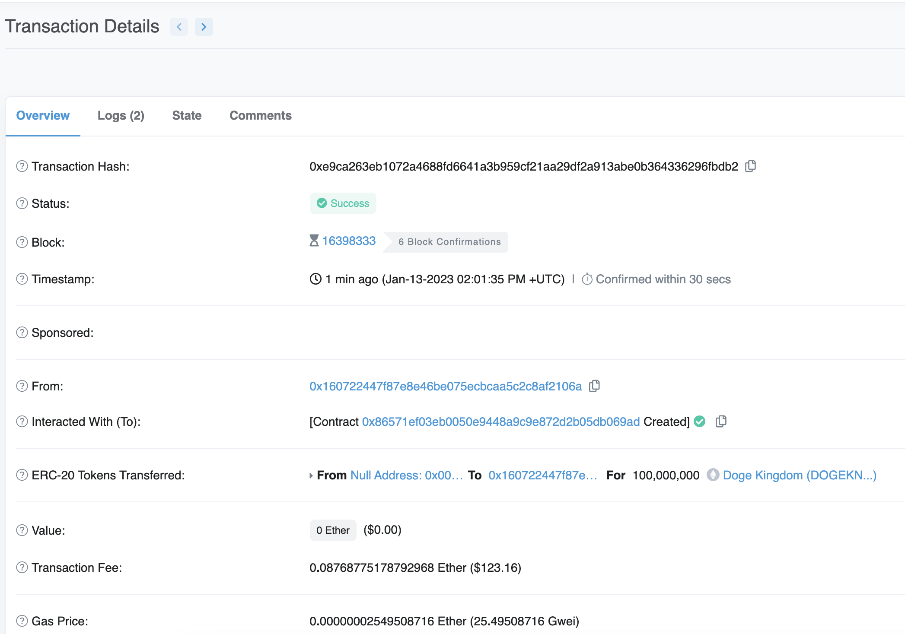

# New Contract Explorer

## Requirement

Please create a program that listens for new blocks (or takes a block number as an input) in an EVM-compatible blockchain and identifies transactions creating new smart contracts.

Suppose you go on the ‘listen to new blocks direction’. In that case, usually, developers use a WebSocket connection to a node and the following method in the web3.js library to listen to new block headers.

— [https://docs.chainstack.com/api/ethereum/web3js-subscriptions#subscribe-newblockheaders](https://docs.chainstack.com/api/ethereum/web3js-subscriptions#subscribe-newblockheaders)

The program needs to be built using a web3 library, such as Web3.js, Ethers.js, or Web3.py, and should have the following functionality:
Connect to a node and listen for new blocks (or takes a block number as input).
Identify transactions that create new smart contracts.
Extract the relevant information:
- New smart contract address
- Address that deployed it
- Transaction hash
Prints the information in the console.
Here is an example of a similar repository.  
[https://github.com/SethuRamanOmanakuttan/MemExplorer](https://github.com/SethuRamanOmanakuttan/MemExplorer)

## How it works
The following code helps the user search on-chain for the deployment of a new contract.
A new contract is identified using the following procedure:
When the application starts, it listens for the publication of new blocks on-chain.
When a block header is downloaded, it loops through all its transactions.
The transaction that identifies a new contract deployment has the following properties:
a. The transaction field ```to``` is ```null```
b. The transaction receipt has a valued contractAddress field.

```javascript
//from subscriber.js
for (let i = 0; i < transactionsCount; i++) {
                try {
                    const transaction = await _web3Object.eth.getTransactionFromBlock(_blockHeader.number, i);
                    const receipt = await _web3Object.eth.getTransactionReceipt(transaction.hash);
                    if (!transaction.to && receipt.contractAddress) {
                        printTransaction(transaction, receipt);
                    }
                } catch (error) {
                    console.error(`Transaction error: ${error}`);
                }
            }
```

The code above shows the iteration loop through the transactions, the condition, and the printing function. 

## Running the program

### Prerequisites

Make sure you have the following prerequisites in your system.

* Node   ^v12.22.7
* NPM    ^6.14.15
* Create a [Chainstack account](https://console.chainstack.com/user/login)

### Step 1 - Deploy a Chainstack node
1. Access the [Chainstack console](https://console.chainstack.com/) and create a new project  
2. Click on the project card and select **Join network**. Now you can configure your client node. In the case of this tutorial, it was selected an Ethereum mainnet node.  Default parameters will work fine when you access the node deployment step. At this point, you only have to choose the cloud infrastructure where you want to deploy the node 
3. When the node is up&running, you can click on it and copy the WSS endpoint.   

### Step 2 - Program configuration
As you can see in the following example, from the console interface of Chainstack, you have to copy the WSS endpoint and paste it into the ```config.json```. 

```json
{
    "ethereum": {
        "wss": "wss://ws-nd-482-375-229.p2pify.com/6c20000000000000000000000c3d0"
    },
    "polygon": {
        "wss": "WSS_ENDPOINT_HERE"
    },
    "name_of_evm_network_here": {
        "wss": "WSS_ENDPOINT_HERE"
    }
}
```
### Step 3 - Run the application
Enter with a terminal prompt into the application folder. At this point, run ```npm install``` and ```npm run test```.

When you select the network configured in the ```config.json``` the application will start to scan the transaction packet into the blocks to find **New Contract instances** (to see some cases, you could wait some minutes). 


### Step 5 - Output example
Here is an output example that you can verify with a [Ethereum blockchain Explorer](https://etherscan.io/)



## Project Details

---

The code makes use of the wss node endpoint and the web3.js library to access the pending transactions. The project aims to keep the accessing process as general and modular as possible to allow the users to connect to several different nodes that are part of several different networks. The user can use this code to connect to the nodes belonging to any EVM-based platforms like Ethereum, Polygon, Binance Smart Chain, Avalanche, fantom, etc.

The project structure is as follows :

```
    ├── config.json
    ├── index.js
    ├── lib
    │   ├── formatter.js
    │   ├── parser.js
    │   ├── prompter.js
    │   └── subscriber.js
    ├── package.json
    └── README.md
```

| Filename      | Usage                                                                                      |
| ------------- | ------------------------------------------------------------------------------------------ |
| config.json   | Contains the platform names and the wss endpoints of nodes in the platforms                |
| formatter.js  | Functions for formatting the text for display                                              |
| parser.js     | Functions for reading, parsing, and validating the contents of config.json file            |
| prompter.js   | Functions for helping the user select between the platforms for accessing the transactions |
| subscriber.js | Functions for setting up subscribers for transactions analysis                             |


---

Thanks to [SethuRamanOmanakuttan](https://github.com/SethuRamanOmanakuttan/MemExplorer)
